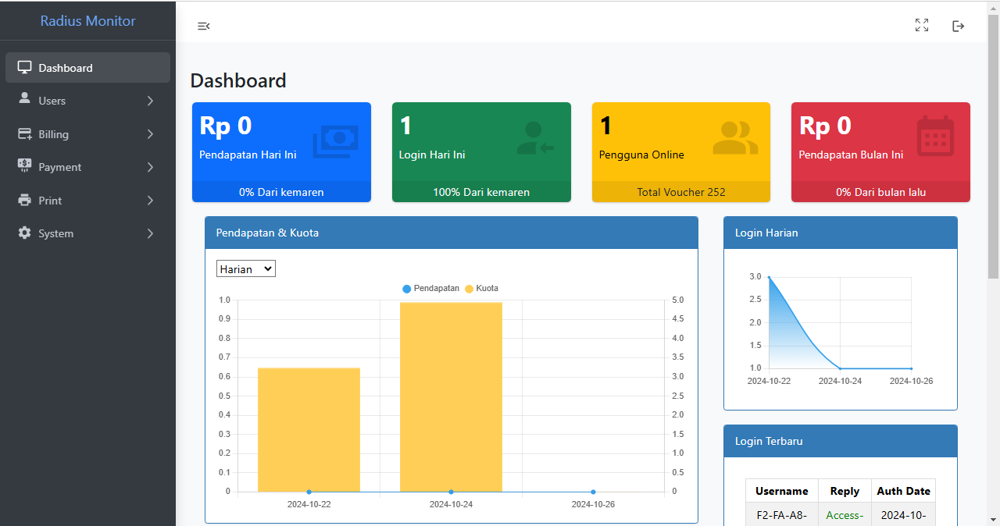
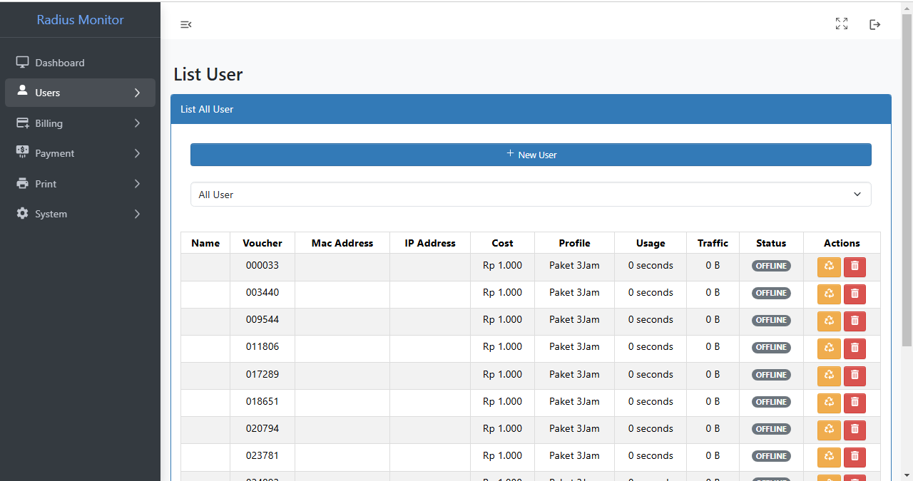
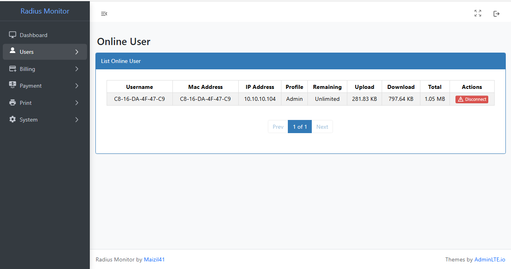
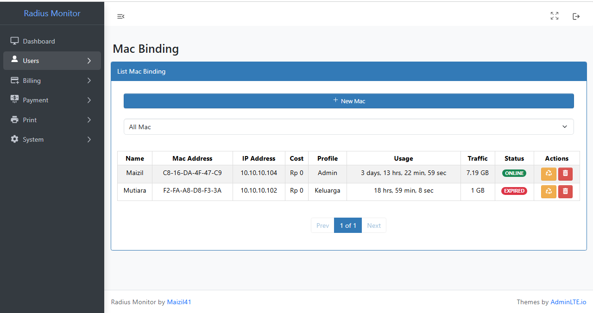
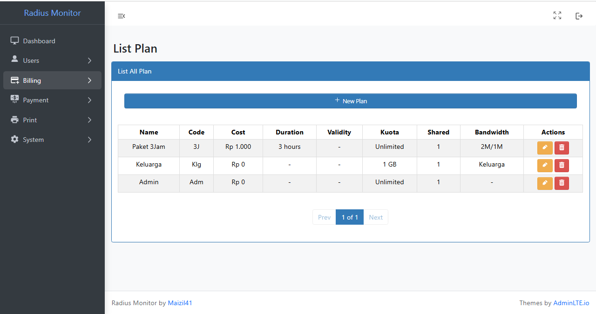
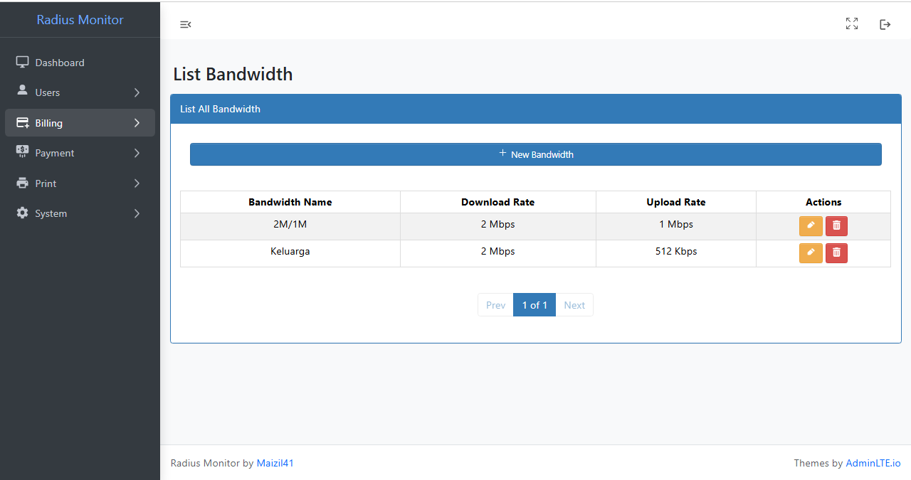
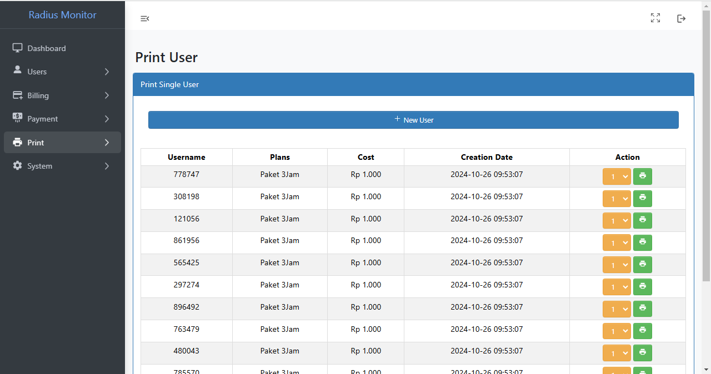
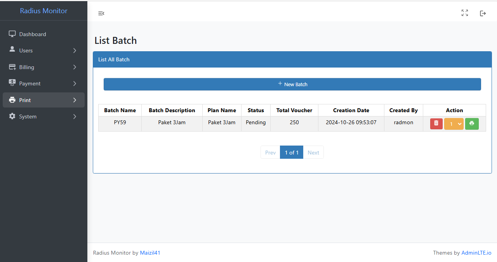
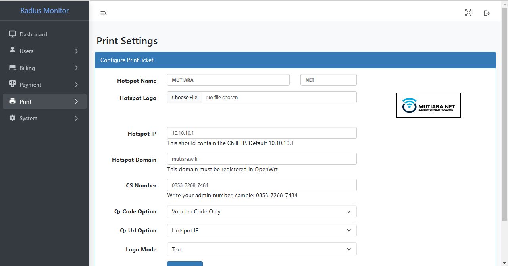
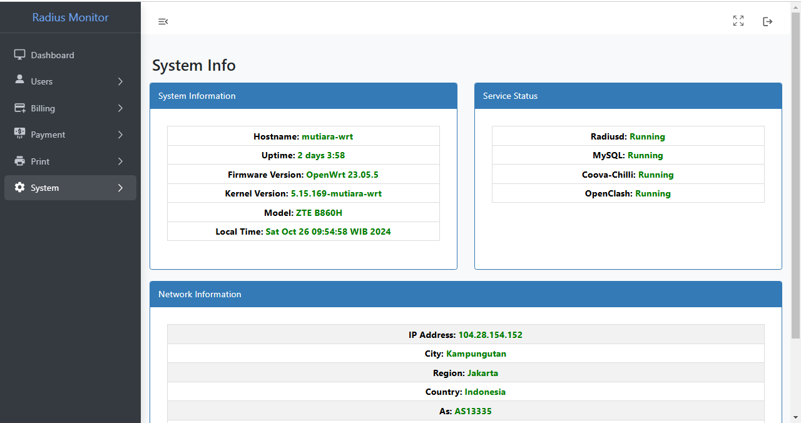

  
  <h1>RADIUS MONITOR</h1>

  
  
  

Packages Needed
---
- MySQL
- Freeradius3
- Coova-Chilli `(For Loginpage)`
- php `7` or `8`
- php-cli, php-mod-mysqli, php-mod-pdo-mysql, php-mod-gd, php-mod-xml, php-mod-filter, php-mod-curl
- iptables-nft `(firewall4)`
- iptables-mod-hashlimit

Features
---
- Add, Edit & Remove Plans
- Add, Edit & Remove Bandwidth
- Add & Remove Users
- Add & Remove Batch
- Mac Binding Support
- Disconnect Users
- Testing Users using Radtest
- Income Calculation
- Database Restore & Backup
- QRCode Tickets support
- WhatsApp Bot Integration
- PPPOE Management `(coming soon)`

Credit
---
<ul>
  <li>Owner : <a href="https://github.com/maizil41" target="_blank">MAIZIL</a></li>
</ul>

<ul>
  <li>Auto Installer : <a href="https://github.com/rtaserver" target="_blank">RTA-SERVER</a></li>
</ul>

Screenshot
---

Dashboard

 

  
 

List Users

 

  
 

Online Users

 

  
 

Mac Binding

 

  
 

Plans

 

  
 

Bandwidth

 

  
 

Print User

 

  
 

Print Batch

 

  
 

Print Setting

 

  
 

System

 

  
 

